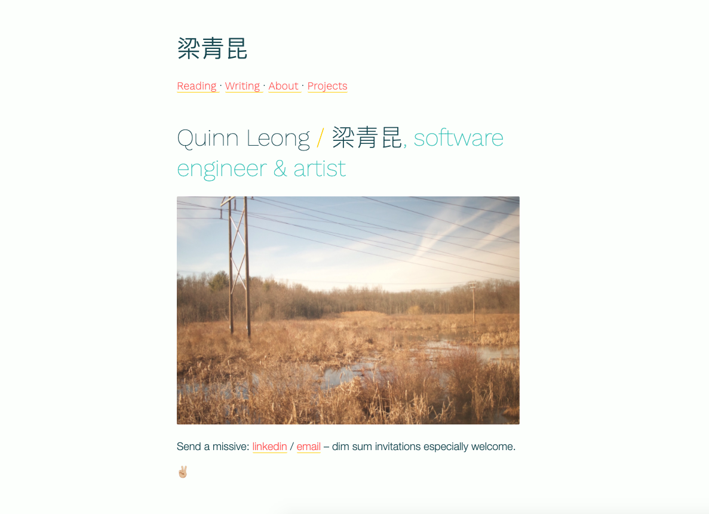

# Peanut Butter

A minimal Jekyll theme, full of blues with a some popsicle highlights. Designed with
a lightweight portfolio + blog in mind.

Live example: [qleong.com](https://qleong.com/)

## Installation

Fork this repo and then clone it. You can then develop your site within that new directory.

## Usage

#### Config
- Set `title` in your `_config.yml` file
- Customize the landing page by editing the front matter in `index.md`
- Start adding your content! You might begin by editing `about.md` or `projects.md`, or creating a new post in `_posts` or book review in `_reading`

#### Available Layouts
- Reading (for book reviews/notes)
- Post (for general writing/blog posts)
- About
- Projects

## Contributing

Feel free to create an issue or PR at https://github.com/quinnleong/peanut-butter.

## Development

Run `bundle exec jekyll serve` and open your browser at `http://localhost:4000`.

## License

For personal, non-monetary use only. Please include credit on your site that links back to this repo!
